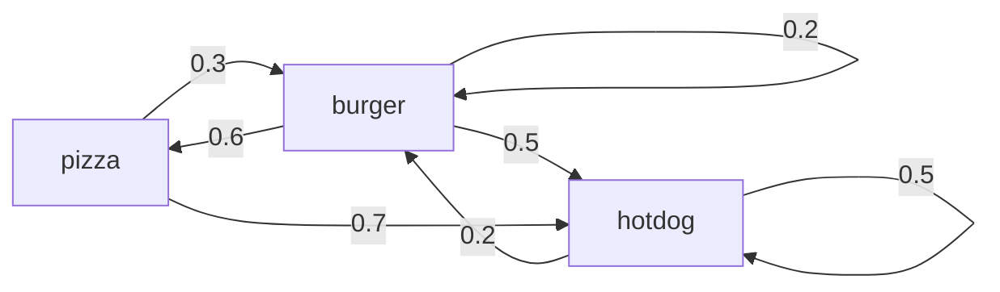

#Graph-HyperNetwork #GHN #Neural-Architecture-Search #NAS

## TODO
---
- [x] Document all references I have collected
	- CORE:
		- Graph Theory:
			- [x] YouTube [Introduction to Graph Theory: A Computer Science Perspective](https://www.youtube.com/watch?v=LFKZLXVO-Dg)
			
		- Graph Neural Networks (GNN):
			- [ ] [Deep Learning For Symbolic Mathematics](https://openreview.net/forum?id=S1eZYeHFDS)
			- [x] [A Gentle Introduction to Graph Neural Networks](https://distill.pub/2021/gnn-intro/)
			- Convolution
				- [ ] [Understanding Convolutions on Graphs](https://distill.pub/2021/understanding-gnns/#extending)
				- [ ] YouTube [But what is a convolution?](https://www.youtube.com/watch?v=KuXjwB4LzSA)
				- [ ] [Convolution & Laplace](https://lpsa.swarthmore.edu/Convolution/ConvLaplace.html)
				- Laplace Transform
					- [ ] [Laplacian](https://mathworld.wolfram.com/Laplacian.html)
					- [ ] [A Short Tutorial on Graph Laplacians, Laplacian Embedding, and Spectral Clustering](https://csustan.csustan.edu/~tom/Clustering/GraphLaplacian-tutorial.pdf)
					- [ ] [Laplace Transform](https://www.wikiwand.com/en/Laplace_transform)
					- [ ] YouTube [Laplace Transform](https://www.youtube.com/watch?v=n2y7n6jw5d0)
			
		- [x] [HyperNetworks](https://openreview.net/forum?id=rkpACe1lx)
		- [x] [Graph HyperNetworks for Network Architectures Search (NAS)](https://arxiv.org/abs/1810.05749)
			
	- Extra:
		- Graph Theory:
			- [x] [Everything you need to know about Graph Theory for Deep Learning](https://towardsdatascience.com/graph-theory-and-deep-learning-know-hows-6556b0e9891b)
			- [ ] [Graph Convolutional Networks — Explained](https://towardsdatascience.com/graph-convolutional-networks-explained-d88566682b8f)
			- [ ] [Graph Neural Network and Some of GNN Applications: Everything You Need to Know](https://neptune.ai/blog/graph-neural-network-and-some-of-gnn-applications)
			
		- Manifolds & Topology
			- [ ] [Neural Networks, Manifolds and Topology](https://colah.github.io/posts/2014-03-NN-Manifolds-Topology/)
			
		- Markov Chains:
			- [ ] YouTube [Markov Chains: Recurrence, Irreducibility, Classes | Part - 2](https://www.youtube.com/watch?v=VNHeFp6zXKU&list=PLM8wYQRetTxBkdvBtz-gw8b9lcVkdXQKV&index=4)
			
	
- [ ] Read and ranklist which references will be used
- [ ] Plan out the structure of the paper
	- [ ] Narrative paper
	- [ ] Limit: 5 pages

## Prerequisite
---
#### 0. Graph Neural Networks (GNN)
[[Graph Neural Networks]]

#### 1. HyperNetworks (HN)
[[HyperNetworks]]

#### 2. Graph HyperNetworks for Network Architectures Search (NAS)

**G**raph **H**yper-**N**etworks (GHN) predict the performance of any unseen neural networks by operating their *computational graph representations*. GHN can be generalized and applied to *anytime-prediction*, and outperform existing manually designed models.

The reason why GHN is a breakthrough in solving complex computational problems is because traditional NAS is expensive for the simple reason that **Stochastic Gradient Descent is expensive**. **A trained HN is well correlated with Stochastic Gradient Descent**, and thus can surrogate the weight generation for the main network.

In this work,
- we advocate for a **computation graph representation because the topology of an architecture can be explicitly modeled**. ^aa4a0b
- Furthermore, it is *intuitive to understand* and can be *easily extensible to various graph sizes*. A graph is representationally more intuitive.

##### Prerequisites
- [[#0. Graph Neural Networks (GNN)|Graph Neural Networks (GNN)]]
- [[#1. HyperNetworks (HN)|Graph HyperNetworks (HN)]]

#### 4. Convolution on Graphs

> [!note]
> This is a core mathematic method in some models.
> 
> *Convolution is essential in preserving the topology of graphs.*

A convolution is traditionally applied on images. However, images in turn can be represented by matrices. Graphs are also represented by matrices. Thus, it is possible to extend convolution to graph.

First we need a graph Laplacian.

## PAPER
---
In recent years, neural networks have increasingly become the go-to modeling method for formulating and solving computationally complex problems of high-dimensionality. *I am convinced that Adopting a better understanding of graph theory and applying to our perspective/interface with the world will allow for a better understanding of the world*. In this paper I will attempt to parse out why the mathematical branch of graph theory is an essential component in this new generation of solving computationally expensive problems, including and beyond neural networks.

Graphs are a very robust representation for complex systems. For problems of flow optimization, a directed graph is a wonderful tool for modeling the critical nexuses and the traffic flow, i.e. input and output towards and away, at these nexuses.

For example, a tree is a very useful graphic structure for modeling a filtering or aggretating process. In machine learning, popular tree structures are decision trees and random forests. However, outside of this feverish field, tree graphs do also enjoy generous adoption. In the field of software requirement engineering, a software application can be explicitly modeled as one or more aggregations of not only functional and nonfunctional requirements for the developers but also other requirements such as environmental (both physically and digitally), financial, in terms of human resources, and so on.

Another example, a Markov chain can be used to represent a probabilistic model for decision making based on prior evidence. Let's say we want to go out and get pizza at a restaurant that is known to serve only one type of food each day. Our only clue for guessing which it would serve today is food it sells on the previous day. This problem can be modeled as a directed graph with three nodes for the types of food and the edges connecting them are the dependent probabilities.

Furthermore, graphs can also be extremely useful where representing the hierarchical structure of a system is significant.

In essence, neural networks are graphs. Even prior to the rise of neural networks, graphs have appeared in a more static forms: images. However, in a neural network, the architecture is very important. The inner layers of a neural network can actually be abstracted into a vector of hyperparameters which then can be tweak to influence the network's performance. This becomes even more apparent when one employs the ensemble method, which involves using mutliple learning methods concurrently and let them vote for the best results.

In this paper I am going to explore a form of graph isomorphism involved preserving the *topology* of a graph. I think this is a very interesting topic, the understanding of which can facilitate solving these high-dimensional problems.

The math required for maintaining *topology* between graphs:
- Laplace transformation and Laplacian matrix
- [Convolution](obsidian://open?vault=437-machine-learning&file=notes%2Fmath%2FConvolution)

1. Convolution

Convolution has been adopted widely in the field of machine learning, in neural networks for image processing. At the end of the day, an image can be represented by a matrix. In other words, a matrix is a special kind of graph. An image is a graph with a very regular grid-like structure, where the individual pixels are nodes, and the RGB channel values at each pixel are the node features.

The [convolution](https://www.wikiwand.com/en/Convolution) of $f$ and $g$ is written $f ∗ g$, denoting the operator with the symbol ∗.

It is defined as *the integral of the product of the two functions **after one is reflected about the y-axis and shifted***. As such, it is a particular kind of [integral transform](https://www.wikiwand.com/en/Integral_transform "Integral transform"):
$$
(f * g)(t) := \int_{-\infty}^{\infty} f(\tau)\cdot g(t-\tau)\cdot d\tau
$$

or (due to commutativity):
$$
(f * g)(t) := \int_{-\infty}^{\infty} f(t-\tau)\cdot g(\tau)\cdot d\tau
$$

where **$\boldsymbol{t}$ is the amount at which the function $\boldsymbol{f(\tau)}$ weighted by the function $\boldsymbol{g(-\tau)}$ is shifted**. As $t$ changes, the weighting function $\boldsymbol{g(t-\tau)}$ *emphasizes different parts of the input function* $\boldsymbol{f(\tau)}$:

- **for** $t > 0$:
	- $\boldsymbol{g(t-\tau)=g(-\tau)}$ that shifts by the amount $t$ along the $\tau$-axis towards $+\infty$
- **for** $t < 0$:
	- $\boldsymbol{g(t-\tau)=g(-\tau)}$ that shifts by the amount $|t|$ along the $\tau$-axis towards $-\infty$

We know that a graph is a discrete structure and thus can be represented in matrix form with degree matrix $D$ and adjacency matrix $A$. Therefore, the convolution procedure is dependent on the polynomials of its Laplacian matrix:

$$
p_w(L) = w_0I_n+w_1L+w_2L^2+\dots+w_dL^d=\sum_{i=0}^{d} w_iL^i
$$

> [!note]
> The convolution at node $v$ occurs only with nodes $u$ which are not more than $d$ hops away. Thus, these polynomial filters are localized. The degree of the localization is governed completely by d.
> 
> In other words, *topology is preserved*.

*This extension of convolution to graphs is a breakthrough*, because it allows for the localization of group neurons aggregated together by a distance $d$. The immediate applications are the following graph neural networks:
- Graph Convolutional Networks (GCN)
- Graph Attention Networks (GAT)
- Graph Sample and Aggregate (GraphSAGE)
- Graph Isomorphism Networks (GIN)

2. 

Thanks to node representation/embedding learning, (embedding: mapping individual nodes to fixed-size real-valued vectors). In other words, a feature vector can be abstracted away into a representational node in a HyperNetwork.

**Transition to Graph [[#2. Graph HyperNetworks for Network Architectures Search (NAS)|HyperNetworks]]**.

**Illustrate the importance of graph representation** via [[HW5#^a39b5a|manifolds]].

> [!link] [Mapping of Manifolds to Decision Making](https://www.youtube.com/watch?v=v6VJ2RO66Ag)
> 
> One important property associated with manifolds is *homeomorphism*, or topological isomorphism, which is an isomorphism from some subdivision of a graph $G$ to some subdivision of another graph $G'$. In other words, where the graphic structure is preserved in *isomorphism*, the topological structure is preserved in *homeomorphism*. For example, performing a subdivision (adding a new node) on some edge in graph $G$ should mean that the same action happens on some edge in the graph $G'$ and simultaneously preserve their isomorphic relation, and thus preserving their local topological mapping.
> 
> Another important thing to be noted about manifolds is that high-dimensional topologies are very often mapped to low-dimensional topologies. For example, the topological gradient of a 3D object is a simple point on a 2D plane in space (which can be obtained via a linear transformation). Similarly, some $N$-dimensional manifold mapped out from some $N$ neurons can represent the overall neural activities (i.e. local states in space-time and various biological feedbacks such as temperature, humidity, and so on). This manifold in turn can be localized to a decision making process in Euclidian space. 
> 
> Furthermore, the graph of $N$ neurons are indeed composed of some $M$ subgraphs of related neurons (neurons that are typically in close proximity and activate on the same input). Thus, it could be further be mapped to a sort of hypernetwork of connected components. 
> 
> Link: https://www.youtube.com/watch?v=v6VJ2RO66Ag

This brings us back to HyperNetwork. HyperNetworks are indeed very useful in represent the manifolds of high dimensional input.

## References
---
- [Graph HyperNetworks for Neural Architecture Search](https://arxiv.org/abs/1810.05749)
- [HyperNetworks](https://openreview.net/forum?id=rkpACe1lx)