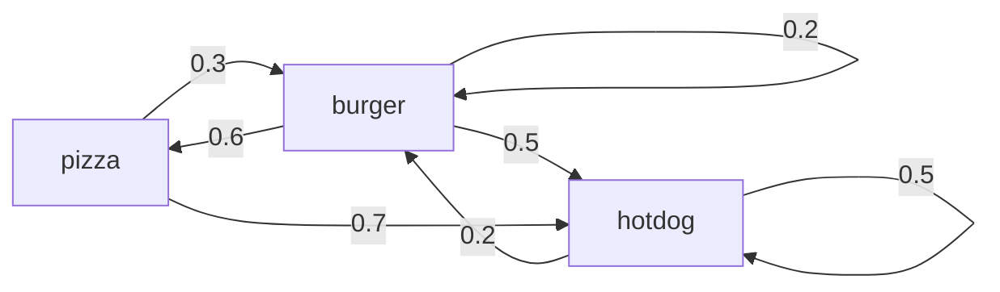
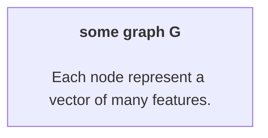
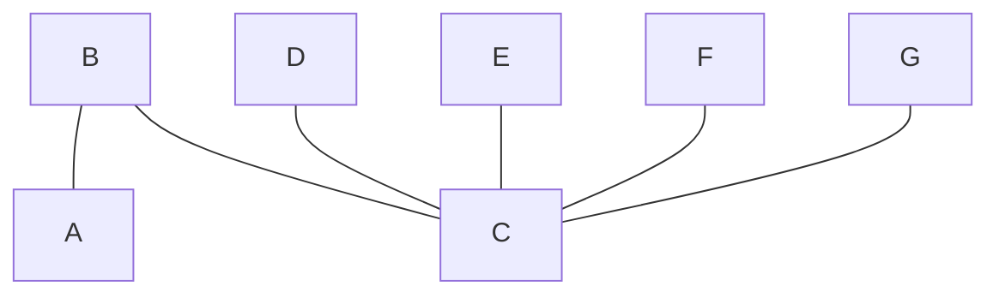

## CptS 453 | Charles Nguyen

<h1 align='center'>Why Convolution Is Important in Modeling Graph Topology for Computationally Complex Problems</h1>

In recent years, neural networks have increasingly become the go-to modeling method for formulating and solving computationally complex problems of high-dimensionality. In essence, neural networks themselves are graphs. Therefore, I am convinced that adopting a better understanding of graph theory will open up our interface with the world to more effective ways of solving problems.

In this paper I will attempt to parse out why the mathematical branch of graph theory is an essential component in this new generation of solving computationally expensive problems, most immediately to my topic of interest, neural networks, and beyond. I am going to explore convolution as a method to manipulate the form of graph isomorphism, effectively preserving or changing the topology of a graph. I think this is a very interesting topic, the understanding of which can open up new ways to solve complex high-dimensional problems.

Graphs are very robust representation for complex systems.

For problems of flow optimization, a directed graph is a wonderful tool for modeling the critical nexuses and the traffic flow, i.e. input and output towards and away, at these nexuses. 

On the other hand, a tree is a very useful graphic structure for modeling a filtering or aggretating process. In machine learning, popular tree structures are adopted in the form of decision trees and random forests. Outside of this field, tree graphs also enjoy generous adoption. In the field of software requirement engineering, a software application can be explicitly modeled as one or more aggregations of functional and nonfunctional requirements. These aggregations are also frequently extended beyond software architecture to include other requirements such as environmental (both physically and digitally), financial, in terms of human resources, and so on.

Another type of graph, a Markov chain, can be used to represent a probabilistic model for decision making based on prior evidence. Let's say we want to go out and get pizza at a restaurant that is known to serve only one type of food each day. Our only clue for guessing which it would serve today is food it sells on the previous day. This problem can be modeled as a directed graph with three nodes for the types of food and the edges connecting them are the dependent probabilities.

Graphs can also be extremely useful where modeling the hierarchical structure of a system is neccessary.

Even prior to the rise of neural networks, graphs have appeared in a more static form: images. However, in a neural network, the architecture is very important. The inner layers of a neural network can actually be abstracted into a vector of hyperparameters which then can be tweak to influence the network's performance. This becomes even more apparent when one employs the ensemble method, which involves using mutliple learning methods concurrently and let them vote for the best results.

In the context of neural networks for processing images, an image can be represented by a matrix. In other words, a matrix is a special kind of graph. An image is a graph with a very regular grid-like structure, where the individual pixels are nodes, and the RGB channel values at each pixel are the node features. At the core of image processing is the mathemical procedure of convolution.

The [convolution](https://www.wikiwand.com/en/Convolution) of a function $f$ and another function $g$ is written $f ∗ g$, with the symbol ∗ as the convolution operator.

In essence, convolution is defined as **the integral of the product of the two functions after one is reflected about the y-axis and shifted**. As such, it is a particular kind of integral transform:
$$
(f * g)(t) := \int_{-\infty}^{\infty} f(\tau)\cdot g(t-\tau)\cdot d\tau
$$

or (due to commutativity):
$$
(f * g)(t) := \int_{-\infty}^{\infty} f(t-\tau)\cdot g(\tau)\cdot d\tau
$$

where **$\boldsymbol{t}$ is the amount at which the function $\boldsymbol{f(\tau)}$ weighted by the function $\boldsymbol{g(-\tau)}$ is shifted**. As $t$ changes, the weighting function $\boldsymbol{g(t-\tau)}$ emphasizes different parts of the input function $\boldsymbol{f(\tau)}$:

- **for** $t > 0$:
	- $\boldsymbol{g(t-\tau)=g(-\tau)}$ that shifts by the amount $t$ along the $\tau$-axis towards $+\infty$
- **for** $t < 0$:
	- $\boldsymbol{g(t-\tau)=g(-\tau)}$ that shifts by the amount $|t|$ along the $\tau$-axis towards $-\infty$

However, this is a for continous form. We want to [extend this to be applicable on graphs](https://distill.pub/2021/understanding-gnns/#extending), which are discrete structures.

In the context of graph theory, we know that, much like an image, a graph can be represented in matrix form with degree matrix $D$ and adjacency matrix $A$. Thus, we perform a linear combination on the Laplacian matrix of the graph with some vector. We produce the following polynomials:
$$
p_w(L) = w_0I_n+w_1L+w_2L^2+\dots+w_dL^d=\sum_{i=0}^{d} w_iL^i
$$

where $\boldsymbol{w}$ is the coefficient vector. Each of these polynomial is effectively a filter in convolutional neural networks, and therefore $d$ is the degree of filter.

For example, we consider a simple graph in which each node represents a vector of features.

Let's say we normalize and simplify all nodes in the graph, such that each has only a representative one-dimensional feature. We then map each node to a coefficient in a new feature vector $\vec{x}$:
$$
\boldsymbol{\vec{x}}: \{x_v\}\quad\text{for each vertex } v\in V.
$$

Now we then can finally define the convolution operation for some filter $p_w$ on the Laplacian matrix with some feature vector as the following dot product:
$$
Conv = p_w(L)\cdot\vec{x}
$$

First, we consider the special case where $w_0=1$ (0) and $w_1=1$ (1). In both cases, we hold all other coefficients to be 0.

(0):
$$
Conv(\vec{x}) = p_w(L)\cdot\vec{x} = \sum_{i=0}^{d=0} w_iL^i\cdot\vec{x} = (1)\cdot I\cdot\vec{x} = \vec{x}
$$

(1):
$$
Conv(\vec{x}) = p_w(L)\cdot\vec{x} = \sum_{i=0}^{d=1} w_iL^i\cdot\vec{x} = (1)\cdot L\cdot\vec{x} = L\cdot\vec{x}
$$

Note that in the case of (1) we apply this convolution for some vertex $v$:
$$
\begin{align}
Conv(\vec{x})_v = (L\cdot\vec{x})_v &= L_v\cdot\vec{x}\cr
&=\sum_{u\in G} L_{vu}\cdot x_u\cr
&=\sum_{u\in G}(D_{vu} - A_{vu})\cdot x_u\cr
&=D_v\cdot x_v - \sum_{u\in G}x_u\cr
\cr
&\text{because for any Laplacian matrix:}\cr
&L_{i,j} = \cases{
\deg(v_i) &if $i=j$\cr
-1 &if $i\neq j$ and $v_i$ is adjacent to $v_j$\cr
0 &otherwise
}
\end{align}
$$

Thanks to the last property, we know that when there are no edges between two nodes $u$ and $v$, or when the distance between them are larger than some previously picked degree $i$, we have an all-zero Laplacian matrix for any node $u$ and $v$:
$$
dist_G(u, v) > 1\quad\text{leads to}\quad L_{vu}^i = 0
$$

This leads to the realization that a convolution between the feature vector and some polynomial filter of degree $d$ produces:
$$
\begin{align}
Conv(\vec{x}) = p_w(L)\cdot\vec{x} &= \sum_{i=0}^{d} w_iL^i\cdot\vec{x}\cr
&=\sum_{i=0}^d w_i\sum_{u\in G}L_{vu}^i x_u\cr
&=\sum_{i=0}^d w_i\underbrace{\sum_{u\in G}L_{vu}^i x_u}_{dist_G(v,u)\leq i}\cr
\end{align}
$$

In other words, a convolution at node $v$ only happens with nodes $u$ that are not more than $d$ hops away from $v$. This implies that the polynomial filters are localized and the degree $d$ is the upperbound to the degree of localization.

From this foundation, we can extend this into spectral convolution to apply for the global graph. In short, by utilizing some [magic](https://distill.pub/2021/understanding-gnns/#spectral) and the eingenvector of $L$, we can effectively manipulate the topology of a graph and produce smoothed out or roughed up versions of it.

This extension of convolution to graphs is a breakthrough, because it allows for the localization of nodes and mapping them into equivariants, effectively preserving the topology of the global graph.

Going in a step further, This has open up a new direction into building HyperNetworks that can operate on the computational graph representation of neural networks. Thanks to node representation/embedding learning, i.e. the mapping of individual nodes to fixed-size real-valued vectors, we can simplify a complex system into a computational graph presentation. In other words, a feature vector can be abstracted away into a representative node in a HyperNetwork.

This leads us to [HyperNetwork](https://openreview.net/forum?id=rkpACe1lx). HyperNetworks are indeed very useful in operating on manifolds, i.e. high dimensional object, which are increasingly becoming more relevant with the exponential generation of data and the accompanying demand for computational throughput.

One important property associated with manifolds is **homeomorphism**, or topological isomorphism, which is an isomorphism from some subdivision of a graph $G$ to some subdivision of another graph $G'$. In other words, where the graphic structure is preserved in isomorphism, the topological structure is preserved in homeomorphism. For example, performing a subdivision (adding a new node) on some edge in graph $G$ should mean that the same action happens on some edge in the graph $G'$ and simultaneously preserve their isomorphic relation, and thus preserving their local topological mapping.

I understand that this is a very advanced topic which is beyond my undergraduate knowledge. Therefore, I will not dig too deep into this. However, I think it is worth noting that manifolds are that high-dimensional topologies and are very often mapped to low-dimensional topologies. For example, the topological gradient of a 3D object is a simple point on a 2D plane in space (which can be obtained via a linear transformation). Similarly, some $N$-dimensional manifold mapped out from some $N$ neurons can represent the overall neural activities (i.e. local states in space-time and various biological feedbacks such as temperature, humidity, and so on). This manifold in turn can be localized to a decision making process in Euclidian space. Furthermore, the graph of $N$ neurons are indeed composed of some $M$ subgraphs of related neurons (neurons that are typically in close proximity and activate on the same input). Thus, it could be further be mapped to a sort of hypernetwork of connected components.

This really ties it to why hypernetworks and the ability to use them to generalize other networks are an incredible breakthrough. In a recent paper, [Graph HyperNetworks for Neural Architecture Search](https://arxiv.org/abs/1810.05749), researchers have been able to predict the performance of any unseen neural networks by operating on top their computational graph representations. Most importantly, Graph HyperNetworks can be generalized and applied to anytime-prediction and have shown to outperform existing manually designed models.

This is another breakthrough in solving complex computational problems in itself. The reason is because traditionally neural network architecture search has been expensive for the simple reason that Stochastic Gradient Descent is expensive to compute. However, a trained HyperNetwork is well correlated with Stochastic Gradient Descent, and thus can effectively surrogate the weight generation for the main network. This allows for the explicit modeling of topology of an architecture. Furthermore, it is intuitive to understand and can be easily extensible to various graph sizes.

## References
---
- [Convolution](https://www.wikiwand.com/en/Convolution)
- [Integral Transform](https://www.wikiwand.com/en/Integral_transform "Integral transform")
- [Laplacian Matrix](https://www.wikiwand.com/en/Laplacian_matrix)
- [HyperNetworks](https://openreview.net/forum?id=rkpACe1lx)
- [Graph HyperNetworks for Neural Architecture Search](https://arxiv.org/abs/1810.05749)