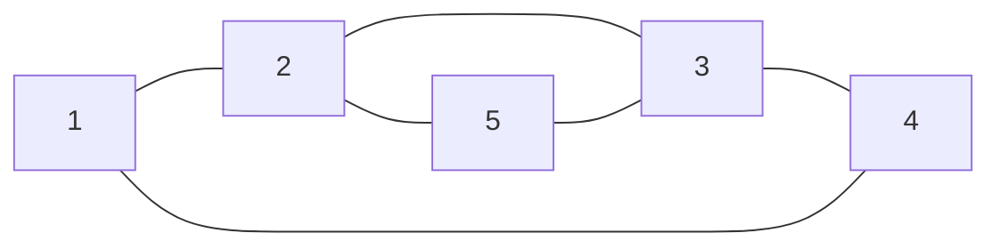

# CPTS 453 | HW6
## CHARLES NGUYEN, 011606177

#### 1. Tree Tight Bounds
---
Non-parent vertices are leaf nodes. Thus the tree has $N=10^{12}$ leaves. This tree has height $H$.

Given some $m$-ary tree, where $m\in\mathbb{N^+}$.

A. Tight lowerbound $\Omega(H)=0$ for any $0$-ary trees. This is an ensemble of totally disconnected nodes.

B. $H$ is maximal for 1-ary tree, however the tight upperbound must also obey the condition that the trees has $N=10^{12}$ leaves. Since any 1-ary trees have only a single leaf node, we choose $m = 2$ for binary trees. Thus, the upperbound for $H$ is the height of complete binary trees of $N$ leaves:
$$
	\theta(H) = \lceil log_2(N+V)\rceil, \mbox{where V are missing leaves of the full tree.}
$$

Then, the tight upperbound of $H$ is:
$$
\Theta(H) = \lceil log_2(N)\rceil
$$

C. Tight lowerbound for rooted binary trees with $N$ nodes.

D. Tight upperbound for $n$-ary rooted binary trees with $N$ nodes.

<div style="page-break-after:always"></div>

#### 2. Tree Shape
---


<div style="page-break-after:always"></div>

#### 3. Chromatic Polynomal, Not 3-Colorable
---


<div style="page-break-after:always"></div>

#### 4. Chromatic Polynomial
---
Given the graph, we call it $X$:

> [!solution]
> 
> This graph is the disjoint union $X = G\sqcup H$ of the following two graphs:
> ```mermaid
> graph LR
> 	title[<b>G</b>]
> 	1 --- 2
> 	2 --- 3
> 	3 --- 4
> 	4 --- 1
> ```
> 
> ```mermaid
> graph LR
> 	title[<b>H</b>]
> 	2 --- 3
> 	2 --- 5
> 	5 --- 3
> ```
> 
> where $G$ is a $2$-regular graph of order 4 ($K_4$), and $H$ is a $2$-regular graph of order 3 ($K_3$).
> 
> We then have,
> $$
> p_{G\sqcup H}(k) = p_G(k)\cdot p_H(k)
> $$
> where,
> $$
> p(k) =\cases{\frac{k!}{(k-n)!} & $\quad k \geq n$ (1) \cr
> 			0 & $\quad k < n$ (2)}
> $$
> 
> Beacuse $(k=3) < (n_G=4)$ and $(k=3)\geq (n_H=3)$, we have,
> $$
> p_{G\sqcup H}(k) = 0\cdot p_H(k) = 0
> $$
