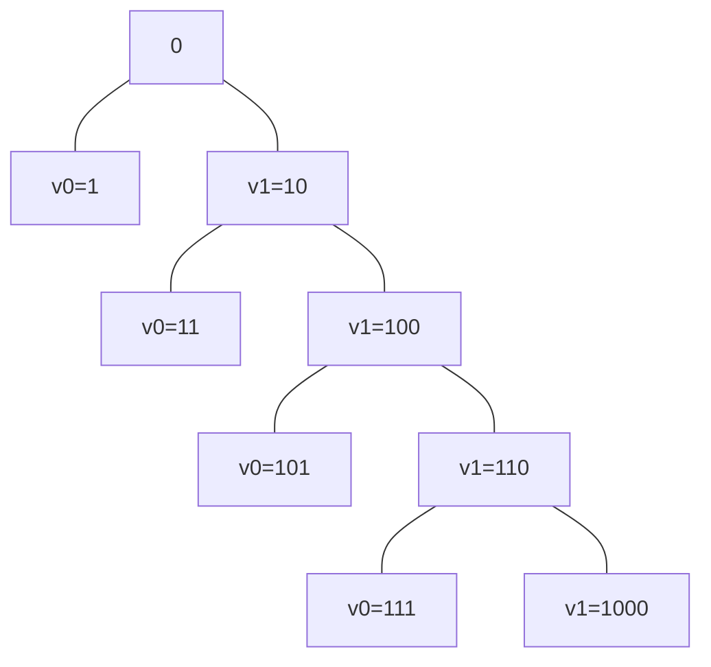
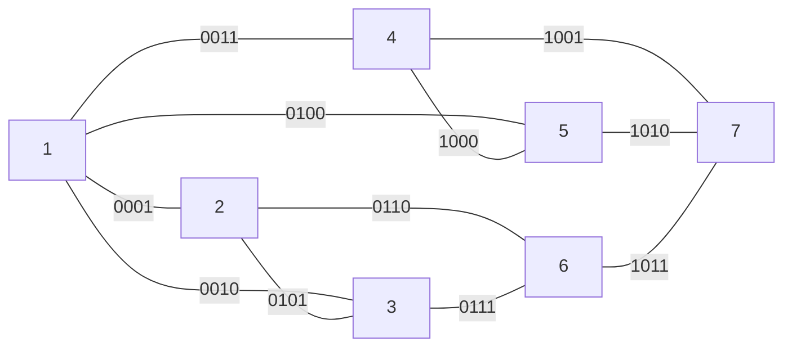
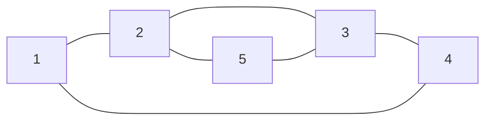

# CPTS 453 | HW6
## CHARLES NGUYEN, 011606177

#### 1. Tree Tight Bounds
---
Non-parent vertices are leaf nodes. Thus the tree has $N=10^{12}$ leaves. This tree has height $H$.

Given some $m$-ary tree, where $m\in\mathbb{N^+}$.

A. Tight lowerbound $\Omega(H)=0$ for any $0$-ary trees. This is an ensemble of totally disconnected nodes.

B. $H$ is maximal for 1-ary tree, however the tight upperbound must also obey the condition that the trees has $N=10^{12}$ leaves. Since any 1-ary trees have only a single leaf node, we choose $m = 2$ for binary trees. Thus, the upperbound for $H$ is the height of complete binary trees of $N$ leaves:
$$
	\theta(H) = \lceil log_2(N+V)\rceil, \mbox{where V are missing leaves of the full tree.}
$$

Then, the tight upperbound of $H$ is:
$$
\Theta(H) = \lceil log_2(N)\rceil
$$

C. Tight lowerbound for $H$ for rooted binary trees with $N$ leaves is also:
$$
\Omega(H) = \lceil log_2(N)\rceil
$$

D. Tight upperbound for $H$ for $n$-ary rooted binary trees with $N$ leaves. Assuming that the tree is nontrivial like in (A),  for $n=N$, all $N$ leaves are connected to a single root node. Thus, the tight lowerbound is the height of $n$-ary tree is:
$$
\Omega(H) = 1.
$$

<div style="page-break-after:always"></div>

#### 2. Tree Shape
---
>[!warning] Rules
> - Binary root tree $(T, r)$
> - each tree's vertex is a finite string over $\{0, 1\}$, i.e. some binary number
> - root is $v_0$
> - if $v_i$ ends at 0, then left-child is $v_0$ and right-child is $v_1$.
> - if $v_i$ ends at 1, then the only child is $v_0$.

A. Draw levels 0 through 4of this tree, with the vertices labeled properly.



B. Make a conjecture of how to compute  the number of vertices at a given level.

Because this tree is amputated on exactly one branch for every level, the number of vertices in the tree can be calculated as:
$$
V = 2l+1, \quad\mbox{where } l=\mbox{levels}
$$

<div style="page-break-after:always"></div>

#### 3. k-Colorable
---
Where k=3 for the given graph,


The graph contains cycles so no $k$-coloring can exists for $k$. Thus, it's not 3-colorable.
<div style="page-break-after:always"></div>

#### 4. Chromatic Polynomial
---
Given the graph, we call it $X$:

> [!solution]
> 
> This graph is the disjoint union $X = G\sqcup H$ of the following two graphs:
> ```mermaid
> graph LR
> 	title[<b>G</b>]
> 	1 --- 2
> 	2 --- 3
> 	3 --- 4
> 	4 --- 1
> ```
> 
> ```mermaid
> graph LR
> 	title[<b>H</b>]
> 	2 --- 3
> 	2 --- 5
> 	5 --- 3
> ```
> 
> where $G$ is a $2$-regular graph of order 4 ($K_4$), and $H$ is a $2$-regular graph of order 3 ($K_3$).
> 
> We then have,
> $$
> p_{G\sqcup H}(k) = p_G(k)\cdot p_H(k)
> $$
> where,
> $$
> p(k) =\cases{\frac{k!}{(k-n)!} & $\quad k \geq n$ (1) \cr
> 			0 & $\quad k < n$ (2)}
> $$
> 
> Beacuse $(k=3) < (n_G=4)$ and $(k=3)\geq (n_H=3)$, we have,
> $$
> p_{G\sqcup H}(k) = 0\cdot p_H(k) = 0
> $$
