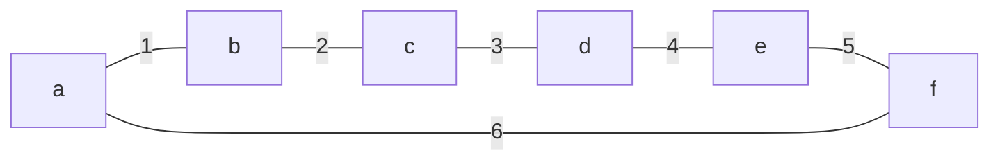
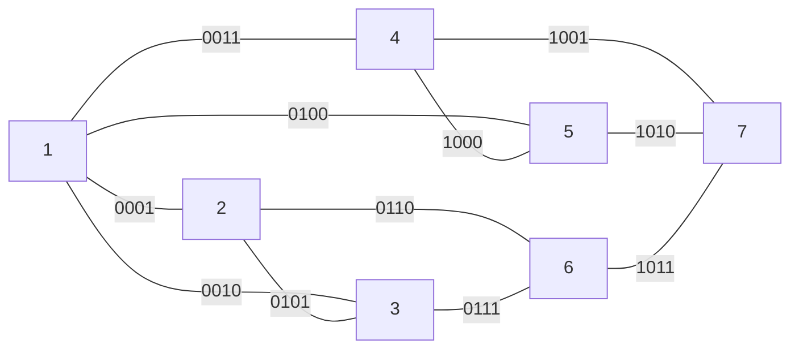

# CPTS 453 Graph Theory -- Assessment

## Charles Nguyen -- 011606177


#### 1. Incidence Matrices
---
Given the matrices:
$$
M_G = 
\begin{bmatrix}
1&1&1&1&0&0&0&0\\
1&0&0&0&1&1&1&0\\
0&1&0&0&1&0&0&1\\
0&0&1&0&0&1&0&1\\
0&0&0&1&0&0&1&0\\
\end{bmatrix};
\quad
M_H =
\begin{bmatrix}
1&1&1&1&0&0&0&0\\
1&0&0&0&1&1&1&0\\
0&1&0&0&1&0&0&1\\
0&0&1&0&0&1&0&0\\
0&0&0&1&0&0&1&1\\
\end{bmatrix}
$$

A. Draw graphs from incidence matrix $G$ and $H$.
> [!solution]
> Their graphs:
> ```mermaid
> graph LR
> 	title[<b>G</b>]
> 	a ---|1| b
> 	a ---|2| c
> 	a ---|3| d
> 	a ---|4| e
> 	b ---|5| c
> 	b ---|6| d
> 	b ---|7| e
> 	c ---|8| d
> ```
> 
> ```mermaid
> graph LR
> 	title[<b>H</b>]
> 	a ---|1| b
> 	a ---|2| c
> 	a ---|3| d
> 	a ---|4| e
> 	b ---|5| c
> 	b ---|6| d
> 	b ---|7| e
> 	c ---|8| e
> ```

B.
> [!solution]
> The two graph $G$ and $H$ are not isomorphic because there is no bijection between the vertex set of $G$ and vertex set of $H$. Counter evident is the number of edges incident on $G.d = 3$ while $H.d = 2$.

<div style="page-break-after: always"></div>

#### 2. Complement Graph
---
A. Suppose $G$ is the six-cycle drawn below. Draw its complement $\overline{G}$.

> [!solution]
> ```mermaid
> graph TD
> 	title[<b>complement of G</b>]
> 	a ---|1| c
> 	a ---|2| d
> 	a ---|3| e
> 	b ---|4| d
> 	b ---|5| e
> 	b ---|6| f
> 	c ---|7| e
> 	c ---|8| f
> 	d ---|9| f
> ```

B. Suppose $G$ is an $r$-regular simple graph of order $n$. Explain why $\overline{G}$ is an $s$-regular simple
graph of order $n$ and determine the value of $s$ in terms of $r$.
> [!solution]
> Given the simple graphs $G$ where $|V_G| = n$ and $\overline{G} = H$ where $|V_H|=n$, by definition of regularity the amount of edges in $G$ and $H$ are:
> $$
> |E_G| = \frac{n\cdot r}{2} = 6; \quad |E_H| = \frac{n\cdot s}{2} = 9
> $$
> $$
> r = 2; \quad s = 3
> $$
> We know that for a complete $k$-regular graph of $n$ vertices, the maximal amount of edges allowed is given by:
> $$
> \begin{aligned}
> &|E|_{max}=\binom{n}{2} = \frac{n\cdot(n-1)}{2} \cr\cr
> &\mbox{for } n = 6\quad\mbox{ then }|E|_{max}= 15
> \end{aligned}
> $$
> 
> We also know that for such maximal $k$-regular graph:
> $$
> n=k+1
> $$
> Thus, because $G$ and $H$ share the same set of vertices, both graphs are totally disconnected (from each other) subgraphs of the maximal $k$-regular graph.
> $$
> |E|_{max} = \frac{n\cdot k}{2} = \frac{n\cdot (r+s)}{2} = \frac{n\cdot r}{2} +\frac{n\cdot s}{2}
> $$
> In order for the $k$-regular graph to be regular, its disconnected components has to be recursively regular:
> $$\mbox{$k$-regular graph} = G \cup H$$
> Thus, $\overline{G}=H$ is $s$-regular, and $s = n-1-r$.

C. If $G = K_{p,q}$ where $p$ and $q$ are positive integers, describe $\overline{G}$.
> [!solution]
> $G$ is a bipartite graph, but $\overline{G}$ is not guaranteed to be a bipartite graph. There is also not enough information for $p$ and $q$ about their complete boundaries in order to describe G's complement.

<div style="page-break-after: always"></div>

#### 3. Adjacency Matrix & Eccentricities
---
Given $G$:


A. Write incidence matrix and adjacency matrix for $G$.
> [!solution]
> $$
> M_G = 
> \begin{bmatrix}
> 1&1&1&1&0&0&0&0&0&0&0\\
> 1&0&0&0&1&1&0&0&0&0&0\\
> 0&1&0&0&1&0&1&0&0&0&0\\
> 0&0&1&0&0&0&0&1&1&0&0\\
> 0&0&0&1&0&0&0&1&0&1&0\\
> 0&0&0&0&0&1&1&0&0&0&1\\
> 0&0&0&0&0&0&0&0&1&1&1\\
> \end{bmatrix}
> $$
> 
> The adjacency matrix of $G$ is:
> $$
> \begin{aligned}
> M_G\cdot M_G^T &= D + A \cr
> A &= M_G\cdot M_G^T - D \cr\cr
> \quad\mbox{where,}\cr
> &\quad D: \mbox{diagonal matrix} \cr
> &\quad A: \mbox{adjacency matrix}
> &\end{aligned}
> $$
> 
> Thus,
> $$
> M_G\cdot M_G^T =
> \begin{bmatrix}
> 4&1&1&1&1&0&0\\
> 1&3&1&0&0&1&0\\
> 1&1&3&0&0&1&0\\
> 1&0&0&3&1&0&1\\
> 1&0&0&1&3&0&1\\
> 0&1&1&0&0&3&1\\
> 0&0&0&1&1&1&3\\
> \end{bmatrix}
> $$
> 
> $$
> D =
> \begin{bmatrix}
> 4& & & & & & \\
>  &3& & & & & \\
>  & &3& & & & \\
>  & & &3& & & \\
>  & & & &3& & \\
>  & & & & &3& \\
>  & & & & & &3\\
> \end{bmatrix}
> ;
> A =
> \begin{bmatrix}
>  &1&1&1&1&0&0\\
> 1& &1&0&0&1&0\\
> 1&1& &0&0&1&0\\
> 1&0&0& &1&0&1\\
> 1&0&0&1& &0&1\\
> 0&1&1&0&0& &1\\
> 0&0&0&1&1&1& \\
> \end{bmatrix}
> $$
 
B.
> [!solution]
> G has diameter 6 (max eccentricity, between 1 and 2: 1-4-5-7-6-3-2) and radius 4 (min eccentricity, between 1 and 7: 1-2-3-6-7).

C. This is the graph from question 3 in homework 6. Explain why ($x − k)$ is a factor of its chromatic polynomial for every $k \in \{0,1,2,3\}$. You are not required to find the chromatic polynomial of $G$.

<div style="page-break-after: always"></div>

#### 4. Circuitry
---
Recall that a **circuit** is a closed walk (one in which the starting and ending vertices are the same) that does not repeat an edge. Explain why if $G$ has a nontrivial circuit, then it must have a nontrivial cycle.
> [!solution]
> A trivial circuit of a graph is a circuit containing only one vertex. Thus, a nontrivial circuit is any circuit that is *not* that. This means a nontrivial circuit has $|V| > 1$. Because a nontrivial circuit is a closed walk, it must have $|V| > 2$. Thus, it also contains at least  a nontrivial cycle.

<div style="page-break-after: always"></div>

#### 5. Boundaries of n-ary tree
---
Let $T$ be a full ternary (3-ary) tree of height 7.

A. Determine, with justification, a tight upper bound on the number of vertices $T$ can have.
> [!solution]
> A full $m$-ary tree of height $h$ has at most:
> $$
> \begin{aligned}
> &\sum_{i=0}^{h-1} m^i
> \quad\mbox{for}\quad \{m=3, h=7\} \quad |V|_{max} = 1093
> \end{aligned}
> $$

B. Determine, with justification, a tight upper bound on the number of edges $T$ can have.
> [!solution]
> a maximal tree (maximum number of vertices $n$) should have $n - 1$ edges. thus,
> $$
> |e|_{max} = 1092
> $$

C. Determine, with justification, a tight upper bound on the number of leaves $T$ can have.
> [!solution]
> A full $m$-ary tree of height $h$ has at most:
> 
> $$
> |L|_{max} = m^{(h-1)} = 729
> $$

D. Determine, with justification, whether it is possible for $T$ to have exactly 100 leaves.
> [!solution]
> Because T is a **full** ternary tree, that means that every internal node must have exactly 3 child nodes. This means that:
> $$|L| \not\equiv 100 \mod 3$$
<div style="page-break-after: always"></div>

#### 6. Cartesian Product
---
Given the cylinder graph $S$ defined as:
$$
S_{q,r} = P_q\times C_r
$$

A. Determine, in terms of $q$ and $r$, the number of vertices in $S_{q,r}$
> [!solution]
> The number of vertices in $S$ is:
> $$
> |V_S| = |P_q\times C_r| = |P_q|\cdot|C_r|=q\cdot r
> $$
 
B. Determine, in terms of $q$ and $r$, the number of edges in $S_{q,r}$
> [!solution]
> A *path graph* $P_q$ has size of $(q-1)$ edges. A *cycle graph* $C_r$ has size of $r$ edges. Therefore,
> 
> $$
> |E_S| = q\cdot(q-1) + r\cdot r
> $$

C. Show that $r$ is even if and only if $S_{q,r}$ is bipartite.
