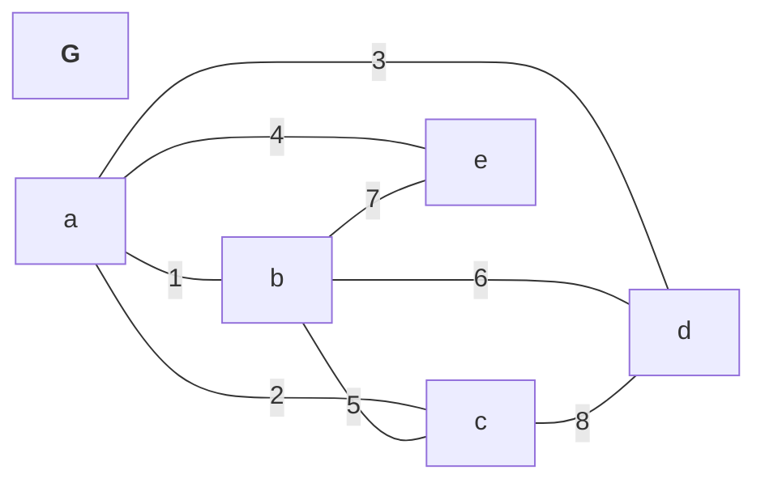
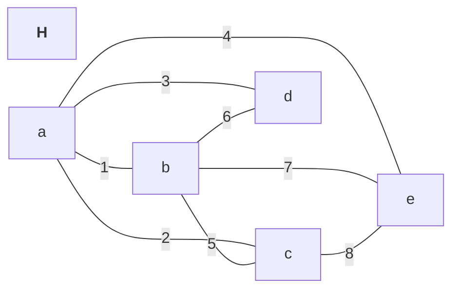
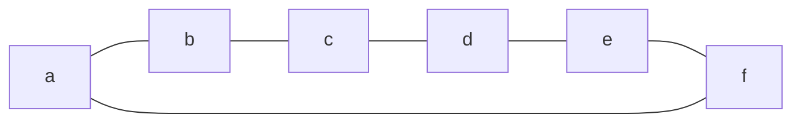
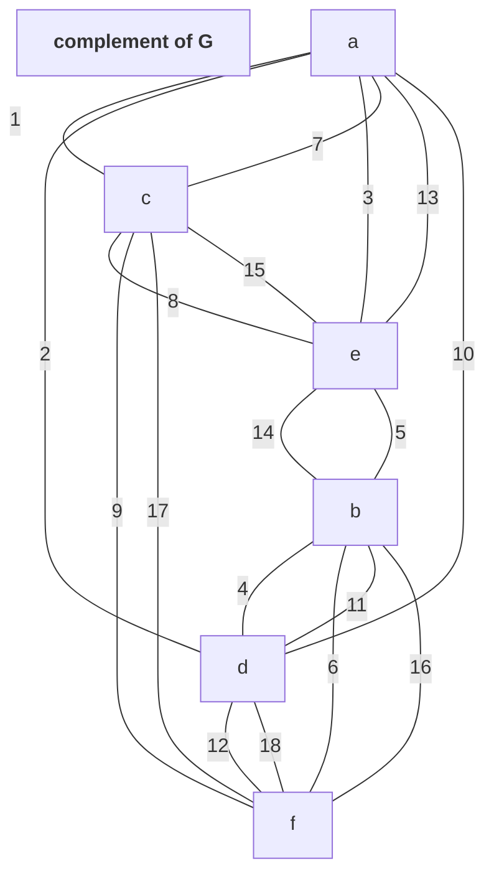
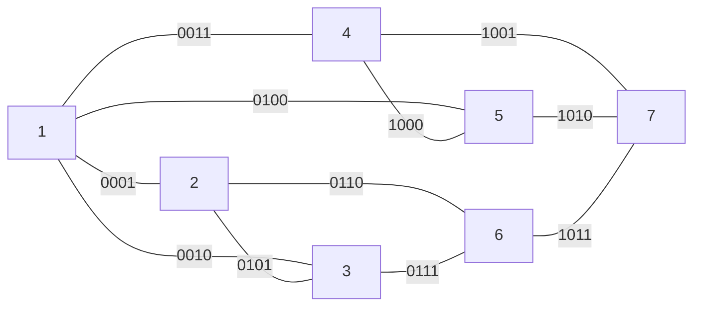

# CPTS 453 Graph Theory -- Assessment

## Charles Nguyen -- 011606177

#### 1. Incidence Matrices
---
A. Draw graphs from incidence matrix $G$ and $H$.

Given the matrices:
$$
M_G = 
\begin{bmatrix}
1&1&1&1&0&0&0&0\\
1&0&0&0&1&1&1&0\\
0&1&0&0&1&0&0&1\\
0&0&1&0&0&1&0&1\\
0&0&0&1&0&0&1&0\\
\end{bmatrix};
\quad
M_H =
\begin{bmatrix}
1&1&1&1&0&0&0&0\\
1&0&0&0&1&1&1&0\\
0&1&0&0&1&0&0&1\\
0&0&1&0&0&1&0&0\\
0&0&0&1&0&0&1&1\\
\end{bmatrix}
$$

Their graphs:

B. The two graph $G$ and $H$ are not isomorphic because there is no bijection between the vertex set of $G$ and vertex set of $H$. Counter evident is the number of edges incident on $G.d = 3$ while $H.d = 2$.

#### 2. Complement Graph
---
A. Suppose $G$ is the six-cycle drawn below. Draw its complement $\overline{G}$.

B. Suppose $G$ is an $r$-regular simple graph of order $n$. Explain why $\overline{G}$ is an $s$-regular simple
graph of order $n$ and determine the value of $s$ in terms of $r$.

C. If $G = K_{p,q}$ where $p$ and $q$ are positive integers, describe $\overline{G}$.

#### 3. Adjacency Matrix & Eccentricities
---
Given $G$:

A. Write incidence matrix and adjacency matrix for $G$.
$$
M_G = 
\begin{bmatrix}
1&1&1&1&0&0&0&0&0&0&0\\
1&0&0&0&1&1&0&0&0&0&0\\
0&1&0&0&1&0&1&0&0&0&0\\
0&0&1&0&0&0&0&1&1&0&0\\
0&0&0&1&0&0&0&1&0&1&0\\
0&0&0&0&0&1&1&0&0&0&1\\
0&0&0&0&0&0&0&0&1&1&1\\
\end{bmatrix}
$$

The adjacency matrix of $G$ is:
$$
\begin{aligned}
M_G\cdot M_G^T &= D + A \cr
A &= M_G\cdot M_G^T - D \cr\cr
\quad\mbox{where,}\cr
&\quad D: \mbox{diagonal matrix} \cr
&\quad A: \mbox{adjacency matrix}
&\end{aligned}
$$

Thus,
$$
M_G\cdot M_G^T =
\begin{bmatrix}
4&1&1&1&1&0&0\\
1&3&1&0&0&1&0\\
1&1&3&0&0&1&0\\
1&0&0&3&1&0&1\\
1&0&0&1&3&0&1\\
0&1&1&0&0&3&1\\
0&0&0&1&1&1&3\\
\end{bmatrix}
$$

$$
D =
\begin{bmatrix}
4& & & & & & \\
 &3& & & & & \\
 & &3& & & & \\
 & & &3& & & \\
 & & & &3& & \\
 & & & & &3& \\
 & & & & & &3\\
\end{bmatrix}
;
A =
\begin{bmatrix}
 &1&1&1&1&0&0\\
1& &1&0&0&1&0\\
1&1& &0&0&1&0\\
1&0&0& &1&0&1\\
1&0&0&1& &0&1\\
0&1&1&0&0& &1\\
0&0&0&1&1&1& \\
\end{bmatrix}
$$

B. G has diameter 6 (max eccentricity, between 1 and 2: 1-4-5-7-6-3-2) and radius 4 (min eccentricity, between 1 and 7: 1-2-3-6-7).

C. This is the graph from question 3 in homework 6. Explain why ($x − k)$ is a factor of its chromatic polynomial for every $k \in \{0,1,2,3\}$. You are not required to find the chromatic polynomial of $G$.

#### 4. Circuitry
---
Recall that a **circuit** is a closed walk (one in which the starting and ending vertices are the same) that does not repeat an edge. Explain why if $G$ has a nontrivial circuit, then it must have a nontrivial cycle.

A trivial circuit of a graph is a circuit containing only one vertex. Thus, a nontrivial circuit is any circuit that is *not* that. This means a nontrivial circuit has $|V| > 1$. Because a circuit is a closed walk, it is also a cycle.

#### 5. Boundaries of n-ary tree
---
Let $T$ be a full ternary (3-ary) tree of height 7.

A. Determine, with justification, a tight upper bound on the number of vertices $T$ can have.
B. Determine, with justification, a tight upper bound on the number of edges $T$ can have.
C. Determine, with justification, a tight upper bound on the number of leaves $T$ can have.
D. Determine, with justification, whether it is possible for $T$ to have exactly 100 leaves.

#### 6.
---
A. Determine, in terms of $q$ and $r$, the number of vertices in $S_{q,r}$
B. Determine, in terms of $q$ and $r$, the number of edges in $S_{q,r}$
C. Show that $r$ is even if and only if $S_{q,r}$ is bipartite.
