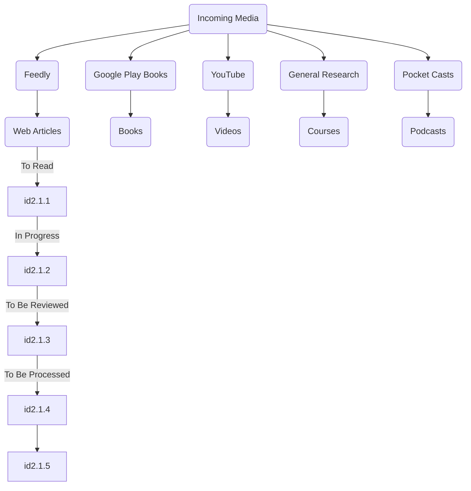

# Friday, August 26 2022

The "n-cube" graph $Q_n$ whose vertex set is:
				$V = \{$n-tuples of 0's and 1's$\} = \{0,1\}^n$

where two vertices are joined by an edge **iff** they *differ by exactly one coordinate*.

In the homework assignment, problem 1C:
				$V = \{(001), (00-1), (010), (0-10), (100), (-100)\}$

**This is a triplet tuple**, thus a graph where two vertices are joined by an edge **iff** they *differ by exactly two coordinates*.

The "complete graph" $K_n$ has vertex set:
				$V = \{0..n-1\}$
				
where any two distinct vertices are joined by a unique edge. More precisely, for vertices $i$ and $j$, $i \neq j$ **iff** there is an edge joining $i$ and $j$.

We'll see soon that **"the total degree"** is twice the number of edges. In $K_n$ each vertex has degree $n-1$ and so the total degree will be $n(n-1)$. Hence. the number of edges is half of this, or

				$m = \frac{n(n-1)}{2} = C(n, 2) = \binom{n}{x})$

Another approach is: every edge can be specified by choosing 2 of the $n$ vertices available.

The complete "bipartite graph" $K_{n,q}$ has vertex set:

				$V=\{$
							$(0,0), (1,0), (2,0)...(p-1,0)$
						$\}$
							$\cup$
						$\{$
							$(0,1),(1,1),(2,1)...(q-1,1)$
						$\}$

Notice that this is a **disjoint** union (a partition into two sets) of two sets; these sets are called the **parts** of $V$. We join two vertices **iff** they differ in the second coordinate. We note that, for $K_{p,q}$ :

				$n=p+q; m=pq$

